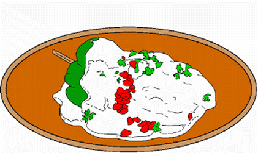

# Chiles en Nogada
## Ingredientes
| Cantidad |Unidad de medida|Ingrediente|
| ----------- | ----------- | ----------- |
| 1  | cucharada | Caldo de costilla KNORR 
| 3  | cucharada | Aceite vegetal 
| 1/4| Un cuarto | Cebolla finamente picada
| 1  | Diente    | Ajo
|200 | Gramos    | Carne molida de res

